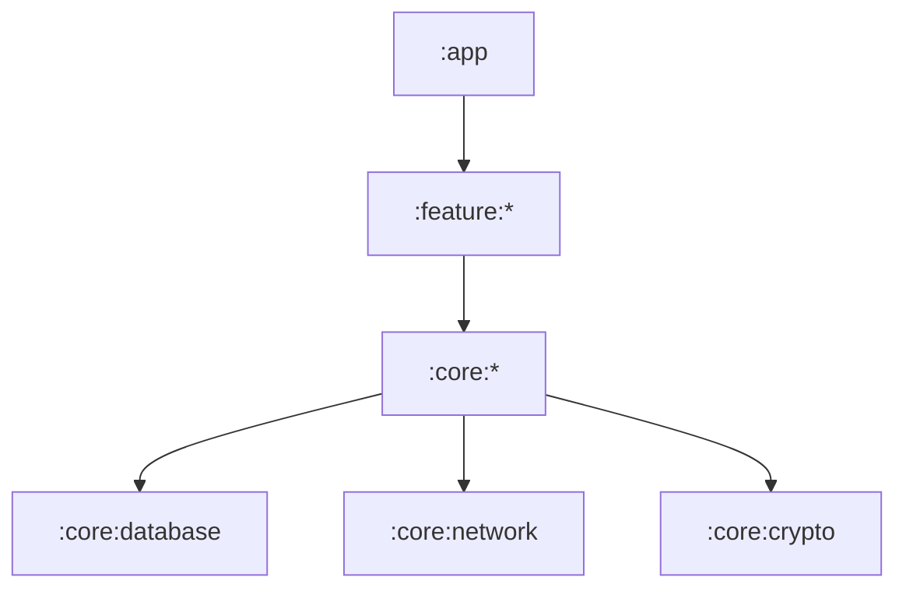

# 🛡️ Cypherchat

> **The Last Word in Privacy.**
>
> *Zero Knowledge. Zero Servers. Zero Compromise.*

[](https://kotlinlang.org)
[](https://developer.android.com/jetpack/compose)
[](LICENSE)
[](https://en.wikipedia.org/wiki/End-to-end_encryption)

---

## 🚀 Overview

**Cypherchat** is not just another messaging app. It is a fortress for your digital conversations. Built with a **zero-trust** architecture, Cypherchat ensures that your data never leaves your device unencrypted and that no central server ever holds your metadata.

Powered by the **SimpleX** protocol, we eliminate the need for user IDs, phone numbers, or central servers. You exist only on your device.

## ✨ Key Features

-   **👻 Ghost Mode**: No phone numbers, no emails, no usernames. Total anonymity.
-   **🔒 Military-Grade Encryption**: Full End-to-End Encryption (E2EE) using double-ratchet algorithms.
-   **🕸️ Decentralized Network**: Built on SimpleX Core. No central point of failure.
-   **📱 Modern UI**: Crafted with **Jetpack Compose** and **Material 3** for a buttery smooth experience.
-   **🗄️ Encrypted Local Storage**: SQLCipher ensures your local database is as secure as the network.
-   **💣 Self-Destructing Messages**: Set timers for messages to vanish without a trace.

## 🛠️ Tech Stack

We use the bleeding edge of Android development technology to ensure performance, security, and maintainability.

| Component | Technology |
| :--- | :--- |
| **Language** | [Kotlin](https://kotlinlang.org/) (Strict Mode) |
| **UI Toolkit** | [Jetpack Compose](https://developer.android.com/jetpack/compose) (Material 3) |
| **Architecture** | MVVM + Clean Architecture |
| **Dependency Injection** | [Koin](https://insert-koin.io/) |
| **Database** | [SQLCipher](https://www.zetetic.net/sqlcipher/) (Encrypted SQLite) |
| **Transport** | SimpleX Core |
| **Async** | Coroutines & Flow |

## 🏗️ Architecture

The project follows a strict multi-module structure to enforce separation of concerns:



-   **`:app`**: The application entry point, DI setup, and navigation.
-   **`:core:crypto`**: Handles all encryption/decryption logic. **Critical security boundaries here.**
-   **`:core:database`**: Encrypted local storage implementation.
-   **`:core:network`**: SimpleX protocol integration and transport layer.

## ⚡ Getting Started

### Prerequisites
-   Android Studio Hedgehog or newer.
-   JDK 17+.
-   Android SDK API 34.

### Installation

1.  **Clone the repository**
    ```bash
    git clone https://github.com/yourusername/cypherchat.git
    cd cypherchat
    ```

2.  **Open in Android Studio**
    Allow Gradle to sync dependencies.

3.  **Build & Run**
    Select `app` configuration and run on an emulator or physical device.

## 🔐 Security Philosophy

1.  **Trust No One**: We assume the network is compromised.
2.  **Root of Trust**: Keys are generated on-device and stored in the **Android Keystore System**. They never leave the hardware security module.
3.  **Sanitization**: Sensitive memory is overwritten immediately after use.

## 🤝 Contributing

We welcome fellow cypherpunks!

1.  Fork the repo.
2.  Create your feature branch (`git checkout -b feature/amazing-feature`).
3.  Commit your changes (`git commit -m 'Add some amazing feature'`).
4.  Push to the branch (`git push origin feature/amazing-feature`).
5.  Open a Pull Request.

## 📄 License

Distributed under the MIT License. See `LICENSE` for more information.

---

<p align="center">
  Built with ❤️ and ☕ by the Cypherchat Team.
</p>
