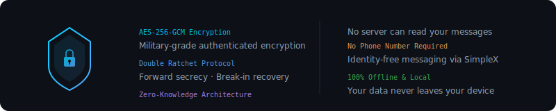

<div align="center">

# 🛡️ C Y P H E R C H A T
### *End-to-End Encrypted Messaging for Android.*

[]()
[]()
[](LICENSE)

**[📲 Download APK](https://github.com/earnerbaymalay/e2eecc/releases)** · **[🌐 Sideload Hub](https://earnerbaymalay.github.io/sideload/)** · **[📖 Usage Guide](docs/USAGE.md)** · **[🔧 Troubleshooting](TROUBLESHOOTING.md)**

</div>

---



## What is Cyph3rChat?

**Cyph3rChat encrypts every message using the Double Ratchet protocol and AES-256-GCM. Instead of creating an account, you generate a unique keypair. Messages are encrypted on your device before transmission, ensuring the relay server only handles ciphertext and has no knowledge of sender or recipient identities.**

---

## Quick Start

### Install on Android

1. Download the latest APK from [GitHub Releases](https://github.com/earnerbaymalay/e2eecc/releases)
2. Enable "Install unknown apps" in Android settings
3. Install and open — no account, no phone number, no server

### Install via Sideload Hub (iPhone PWA)

📲 **[Open Cyph3rChat PWA](https://earnerbaymalay.github.io/sideload/cypherchat/)** — install from Safari on iPhone, or any browser on desktop. WebCrypto encryption runs entirely in your browser.

### Build from Source

```bash
git clone https://github.com/earnerbaymalay/e2eecc.git
cd cyph3rchat
```

Open in Android Studio → Sync Gradle → Run (Minimum SDK 24, Target SDK 34, JDK 17 required).

---

## Cryptography

| Layer | Algorithm | Purpose |
|-------|-----------|---------|
| Key storage | Android Keystore (hardware-backed) | Generates and protects AES-256-GCM keys. |
| Symmetric encryption | AES-256-GCM | Encrypts message payloads with 128-bit authentication tag. |
| Key derivation | HKDF-SHA256 (RFC 5869) | Derives message keys from the root chain. |
| Key agreement | ECDH (P-256 / secp256r1) | Diffie-Hellman key exchange for Double Ratchet. |
| Double Ratchet | Root chain + Message chains | Forward secrecy and break-in recovery. |
| Database at rest | SQLCipher (AES-256-CBC) | Encrypts entire database file. |

Plaintext messages are never written to disk; only ciphertext is stored. Chain keys and passphrases are securely erased from memory after use.

---

## Architecture

```
cyph3rchat/
├── app/                          # Jetpack Compose UI, Koin DI
│   ├── CypherchatApplication
│   ├── MainActivity              # NavHost, PIN lock, JSON export
│   └── ui/screen/
│       ├── OnboardingScreen
│       ├── ChatListScreen
│       └── ConversationScreen
├── core/
│   ├── common/                   # SecureResult<T>, Logger, DispatcherProvider
│   ├── crypto/                   # KeyStoreManager, AesGcmCipher, HkdfDerivation, DoubleRatchetState
│   ├── database/                 # SQLCipher Room database
│   └── network/                  # SimplexTransport interface
└── design/cypherchat-ui.html     # UI reference mockup
```

---

## Screens & Workflow

```
Onboarding                       Chat List
┌─────────────────┐              ┌─────────────────┐
│  🛡️ Welcome     │              │  🔒 Cyph3rChat  │
│                 │              │                 │
│ No accounts.    │              │  [+] New Chat   │
│ No servers.     │              │                 │
│ No phone nums.  │              │  No conversations│
│                 │              │  yet.            │
│ [Get Started]   │              │                 │
└─────────────────┘              └─────────────────┘

Conversation                     Settings
┌─────────────────┐              ┌─────────────────┐
│ 🔒 Alice        │              │ 🔑 Key Fingerprint│
│                 │              │  A1:B2:C3:...    │
│ [Encrypted msg] │              │                 │
│   [Encrypted]   │              │ 📤 Export Chat   │
│                 │              │                 │
│ [Type message]  │              │ 🗑️ Delete All   │
└─────────────────┘              └─────────────────┘
```

### Starting a Conversation

1. Tap the **'+' button** to generate an invitation link.
2. **Share the link** securely via a trusted channel (in person, encrypted email).
3. Once your contact accepts, the chat appears.
4. Messages are encrypted automatically — zero configuration needed.

---

## Build and Run

### Android

```bash
git clone https://github.com/earnerbaymalay/e2eecc.git
cd cyph3rchat
```

Open in Android Studio → Sync Gradle → Run (Minimum SDK 24, Target SDK 34, JDK 17 required).

### Running Tests

```bash
./gradlew test                 # Unit tests
./gradlew connectedAndroidTest # Instrumentation tests (device/emulator)
./gradlew lintDebug            # Lint checks
./gradlew assembleRelease      # Build release APK
```

---

## Related Projects

<div align="center">

| Project | Platform | Description | Link |
|---------|----------|-------------|------|
| 🌗 **Gloam** | 📱 Android / 🖥️ Desktop | Solar-timed CBT journal | [Source →](https://github.com/earnerbaymalay/Gloam) |
| 🌌 **Aether** | 📱 Android (Termux) | Local-first AI workstation | [Source →](https://github.com/earnerbaymalay/aether) |
| 📲 **Sideload Hub** | 🌐 Web / PWA | Central app distribution | [Open Hub →](https://earnerbaymalay.github.io/sideload/) |
| 🧰 **Termux-Vault** | 📱 Android | Encrypted secrets manager | [Source →](https://github.com/earnerbaymalay/Termux-Vault) |

</div>

---

## Documentation

- **[📖 Usage Guide](docs/USAGE.md)** — Installation, starting conversations, security best practices, privacy details.
- **[🔧 Troubleshooting](TROUBLESHOOTING.md)** — Build issues, messaging problems, database corruption recovery.
- **[🗺️ Roadmap](docs/ROADMAP.md)** — Planned: SimpleX SDK integration, media support, backup/restore, F-Droid submission.
- **[📐 Architecture](docs/ARCHITECTURE.md)** — Module breakdown, DI setup, crypto flow.
- **[🔒 Security](docs/SECURITY.md)** — Threat model, cryptographic audit details, key management.
- **[🤝 Contributing](CONTRIBUTING.md)** — How to contribute, code of conduct.

---

## Privacy

- **No accounts:** No phone numbers, usernames, or server registration.
- **End-to-end encryption:** Every message encrypted with AES-256-GCM + Double Ratchet.
- **No cloud storage:** Messages encrypted on-device, relay server sees only ciphertext.
- **No analytics:** No tracking, crash reporting, or telemetry.
- **Hardware-backed keys:** Android Keystore protects encryption keys in TEE.
- **Clean uninstall:** All data deleted on uninstall, nothing persists on any server.

---

[MIT License](LICENSE)
